# [프로젝트 1] 자동화 도구 비교 구현 보고서 — Make vs Zapier

- 작성자: 임유정
- 작성일: 2026-07-20
- 사용 도구: Make, Zapier

---

## 1. 개요

동일한 자동화 워크플로우를 Make와 Zapier 두 도구로 각각 구현하고, 구현 과정과 사용 경험을 바탕으로 두 도구를 비교 분석한다.

### 대상 워크플로우: 지원자 사전 테스트 점수 자동 분류

교육 프로그램 지원자가 온라인 사전 테스트를 제출하면, 점수에 따라 담당자가 수작업으로 합격/불합격 시트에 나눠 기록하고 팀 채널에 알리던 반복 업무를 자동화한다. 테스트 제출 데이터(이름·이메일·점수)는 Webhook으로 수신한다.

| 구성 요소 | 내용 |
|---|---|
| Trigger (1개) | Webhook — 지원자 테스트 제출 데이터(name, email, score) 수신 |
| 조건 분기 (1개) | 점수 80점 이상 / 미만으로 경로 분기 |
| Action (2개 이상) | ① Google Sheets에 행 추가 ② Slack 채널 메시지 발송 (경로별 각 2개, 총 4개) |

### 워크플로우 흐름도

```
[지원자 테스트 제출 → Webhook 수신]
        │
        ▼
   [조건 분기: score ≥ 80?]
        │
   ┌────┴────┐
  YES        NO
   │          │
   ▼          ▼
[Sheets     [Sheets
 합격자 탭    불합격자 탭
 행 추가]     행 추가]
   │          │
   ▼          ▼
[Slack      [Slack
 #pass 알림]  #fail 알림]
```

두 분기 경로 모두 실제로 1회 이상 실행하여 결과를 확인했다. (92점 데이터 1건, 65점 데이터 1건을 각각 웹훅으로 전송)

---

## 2. Make 구현

### 2.1 시나리오 구성

| 단계 | 모듈 | 설정 |
|---|---|---|
| Trigger | Webhooks – Custom Webhook | 웹훅 URL 생성, JSON(name/email/score) 수신 시 즉시 실행 |
| Router | Router (2개 경로) | 경로 1 필터: `score >= 80` / 경로 2 필터: `score < 80` |
| Action 1-A | Google Sheets – Add a Row | `지원자 관리` 시트의 `합격자` 탭에 이름·이메일·점수·접수시각 기록 |
| Action 1-B | Slack – Create a Message | #pass 채널에 "[합격] {이름} — {점수}점" |
| Action 2-A | Google Sheets – Add a Row | `불합격자` 탭에 기록 |
| Action 2-B | Slack – Create a Message | #fail 채널에 "[불합격] {이름} — {점수}점" |

### 2.2 구현 과정 요약

1. Custom Webhook 모듈로 웹훅 생성 → 발급된 URL로 테스트 JSON을 1회 전송해 데이터 구조 자동 인식
2. Router 모듈 추가 → 각 경로 연결선에 필터 조건(숫자 비교: Greater than or equal / Less than) 설정
3. 각 경로에 Google Sheets(Add a Row), Slack(Create a Message) 모듈을 연결하고 웹훅 데이터를 필드에 매핑
4. "Run once"로 수동 테스트 → 정상 동작 확인 후 스케줄링 활성화
5. 92점 / 65점 데이터를 각각 전송해 두 경로 모두 실행됨을 History에서 확인

### 2.3 구현 화면

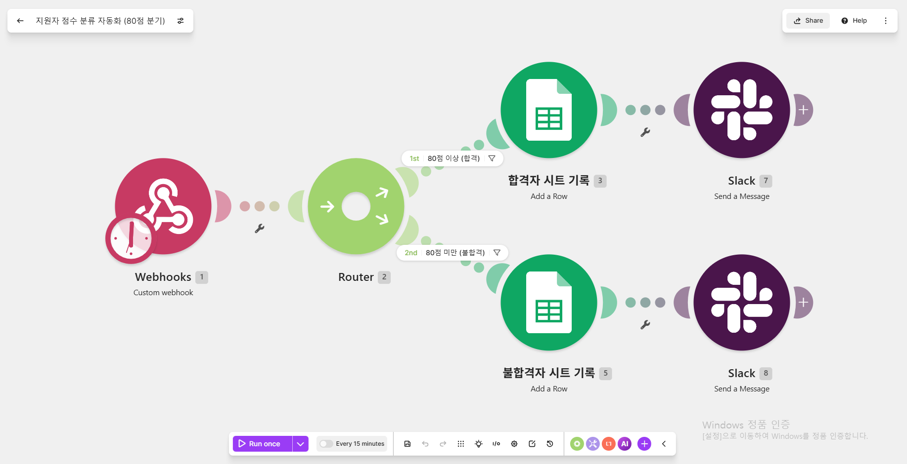

### 2.4 실행 결과

1. PASS
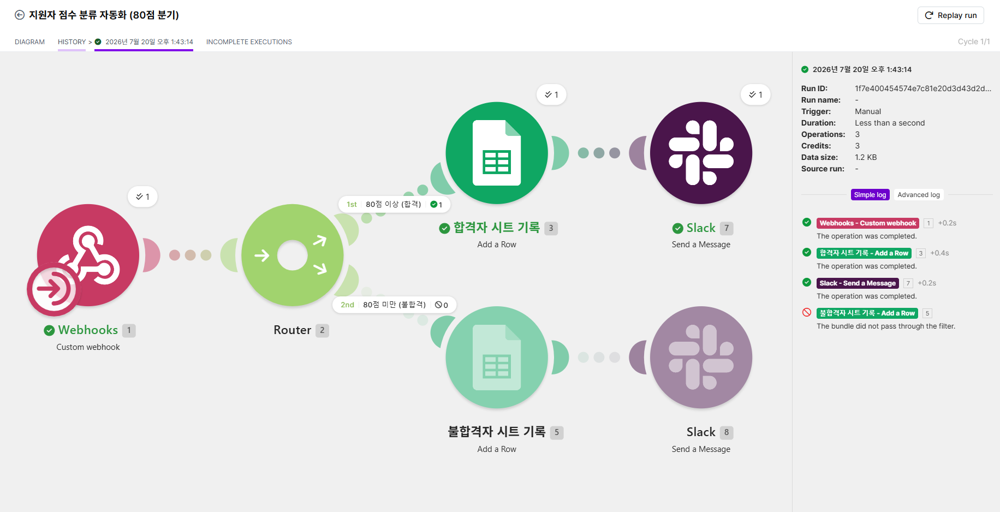
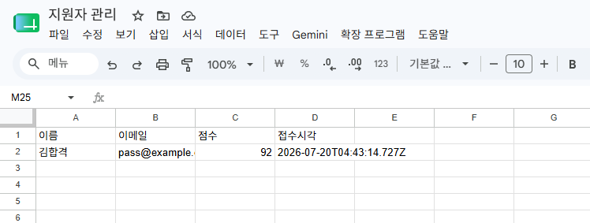
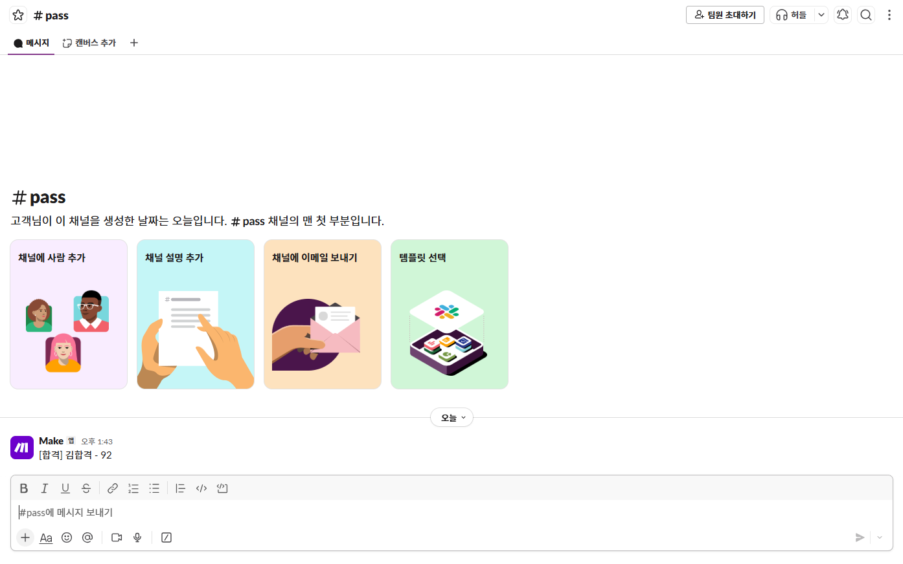

2. FAIL
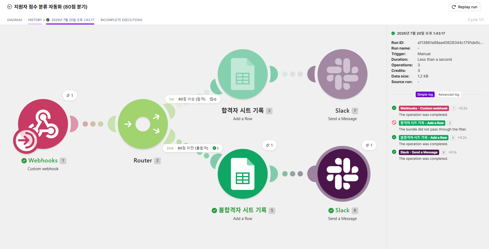
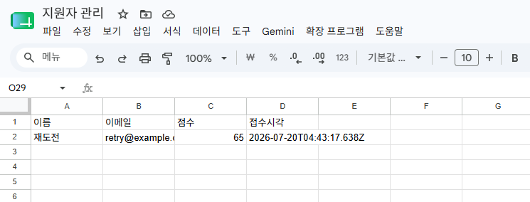


---

## 3. Zapier 구현

### 3.1 Zap 구성

Zapier에서 Make의 Router에 해당하는 기능은 Paths(if/then 분기)다. 무료 플랜은 2단계 Zap(트리거 1 + 액션 1)만 지원해 Paths와 Webhooks(프리미엄 앱)를 쓸 수 없으므로, Professional 14일 무료 체험으로 구현했다. (상세 사유는 6장 참고)

| 단계 | 모듈 | 설정 |
|---|---|---|
| Trigger | Webhooks by Zapier – Catch Hook | 웹훅 URL 발급, JSON 수신 |
| Paths | Path A: `score ≥ 80` / Path B: `score < 80` | 각 Path에 숫자 비교 조건 설정 |
| Path A – Action 1 | Google Sheets – Create Spreadsheet Row | `합격자` 워크시트 |
| Path A – Action 2 | Slack – Send Channel Message | #pass 채널 |
| Path B – Action 1 | Google Sheets – Create Spreadsheet Row | `불합격자` 워크시트 |
| Path B – Action 2 | Slack – Send Channel Message | #fail 채널 |

### 3.2 구현 과정 요약

1. Zap 생성 → 트리거로 Webhooks by Zapier(Catch Hook) 선택, 발급된 URL로 테스트 JSON 전송 후 "Test trigger"로 필드 확인
2. Paths 스텝 추가 → 각 Path의 조건 규칙(Number Greater than / Less than) 설정
3. 각 Path에 Google Sheets, Slack 액션을 추가하고 트리거 필드를 매핑
4. 스텝별 "Test step"으로 개별 검증 후 Zap 게시(Publish)
5. 92점 / 65점 데이터를 각각 전송해 Zap History에서 두 Path 실행 확인

### 3.3 구현 화면

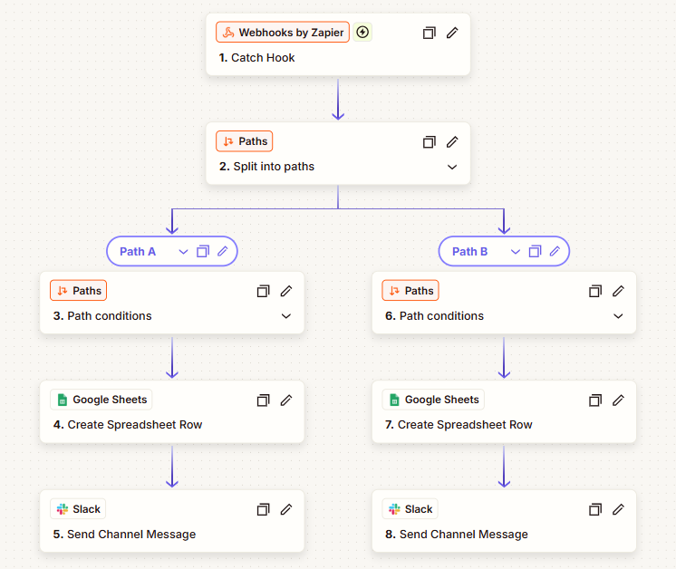

### 3.4 실행 결과

1. PASS
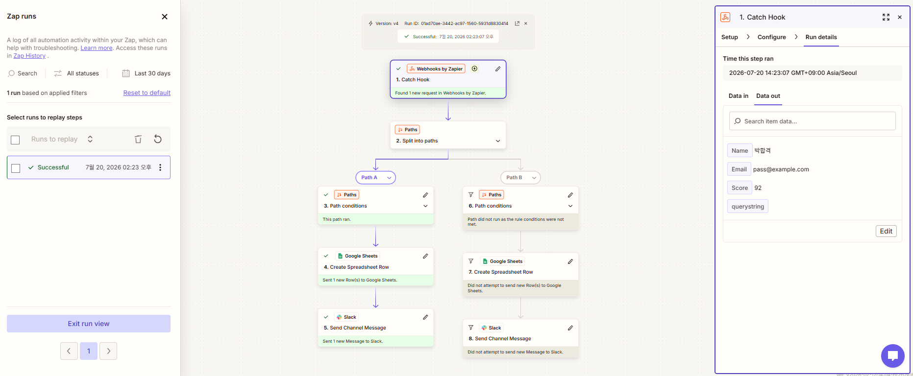
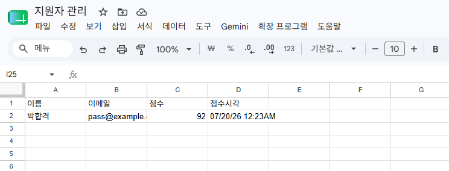


2. FAIL
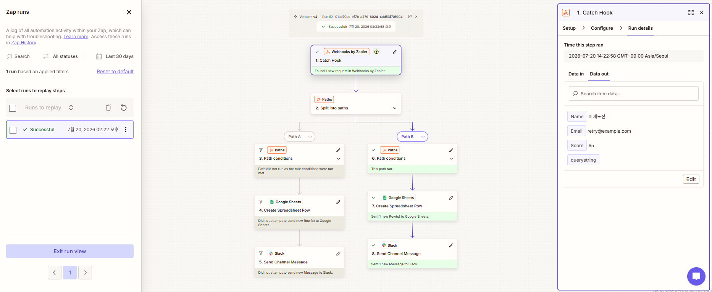
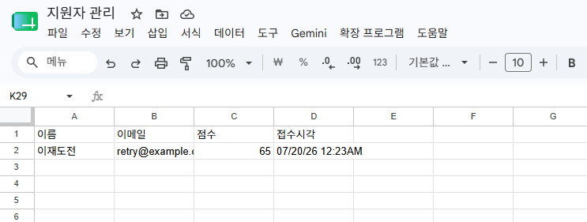
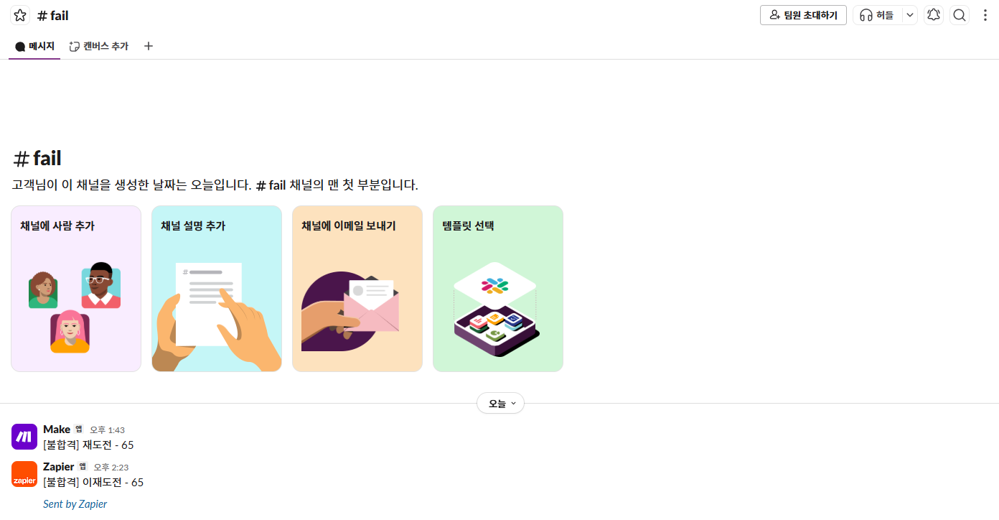

---

## 4. 비교 분석

### 4.1 비교표 (7개 항목)

| # | 비교 항목 | Make | Zapier |
|---|---|---|---|
| 1 | UI/UX | 시각적 노드(캔버스) 기반. 전체 흐름과 분기 구조가 한눈에 보임 | 세로 리스트(스텝) 기반. 단순 흐름은 읽기 쉽지만 분기가 많아지면 전체 구조 파악이 어려움 |
| 2 | 설정 난이도 | 데이터 매핑·필터 문법 등 초기 학습 곡선이 있음. 익숙해지면 세밀한 제어 가능 | 각 단계마다 가이드와 테스트 버튼을 제공해 초보자에게 가장 직관적 |
| 3 | 조건 분기·웹훅 지원 | 무료 플랜에서도 Router/Filter, Webhook 모두 사용 가능 | Paths(분기)·Filter는 유료 기능, Webhooks는 프리미엄 앱. 무료 플랜은 2단계 Zap만 가능 |
| 4 | 무료 플랜 범위 | 월 1,000크레딧(모듈 실행 1회 = 1크레딧), 활성 시나리오 2개, 폴링형 트리거 최소 간격 15분(웹훅은 즉시) | 월 100태스크(액션 실행 1회 = 1태스크, 트리거·필터는 미차감), 2단계 Zap 한정, 폴링 15분 |
| 5 | 과금 단위 | 크레딧(operation) 단위 — 모든 모듈 실행이 1크레딧씩 차감되어 스텝이 많으면 소모가 빠름 | 태스크 단위 — 액션만 차감되어 단순 워크플로우는 유리하나, 태스크당 단가가 Make보다 높음 |
| 6 | 실행 로그 확인 | History에서 각 실행의 모듈별 입출력 데이터(번들)를 단계 단위로 상세 확인 가능 → 디버깅에 매우 유리 | Zap History에서 실행 성공/실패와 각 스텝 데이터 확인 가능. Make 대비 데이터 흐름 추적은 간략한 편 |
| 7 | 연동 서비스 범위 | 약 3,000개 이상 앱. HTTP/Webhook 모듈로 미지원 서비스도 직접 연결 가능 | 약 7,000개 이상 앱으로 커넥터 수는 최다. 단, 일부 앱은 "Premium"으로 유료 플랜 전용 |

### 4.2 구현하며 체감한 차이

- 분기 설계: Make는 Router에서 경로를 옆으로 나란히 배치해 "합격/불합격" 두 갈래가 시각적으로 명확했다. Zapier의 Paths도 기능은 동일하지만 세로 스크롤이 길어져 전체 구조를 한 화면에서 보기 어려웠다.
- 웹훅 테스트 경험: 두 도구 모두 웹훅 수신은 즉시 실행됐다. Make는 첫 요청으로 데이터 구조를 자동 인식하는 방식, Zapier는 "Test trigger"로 수신된 요청을 선택하는 방식이라 흐름은 다르지만 난이도 차이는 크지 않았다.
- 테스트 방식: Zapier는 스텝마다 "Test step" 버튼이 있어 개별 검증이 편했다. Make는 "Run once"로 전체를 돌려야 해서 초반엔 불편했지만, 실행 후 각 모듈 위에 뜨는 데이터 번들을 클릭해 확인하는 방식이 디버깅에는 더 강력했다.
- 비용 체감: 같은 워크플로우 1회 실행 시 Make는 3크레딧(웹훅 + 시트 + 슬랙)을 소모했고, Zapier는 2태스크(시트 + 슬랙, 트리거/Paths는 미차감)를 소모했다. 단위 소모는 Zapier가 적지만 무료 한도(100 vs 1,000)와 기능 제한을 감안하면 이번 과제 조건에서는 Make가 훨씬 여유로웠다.

---

## 5. 각 도구의 장단점 및 적합 상황

### Make

장점
- 무료 플랜에서도 Router/Filter·Webhook 등 핵심 기능을 제한 없이 사용 가능
- 노드 기반 캔버스로 복잡한 다분기 워크플로우도 구조 파악이 쉬움
- 실행 히스토리에서 모듈별 입출력 데이터를 상세히 확인할 수 있어 디버깅 용이
- 크레딧당 비용이 저렴해 장기적으로 유지 비용이 낮음

단점
- 초기 학습 곡선이 있음 (데이터 매핑, 필터 문법, 번들 개념 등)
- 무료 플랜은 폴링형 트리거 최소 간격 15분, 활성 시나리오 2개 제한
- 스텝(모듈)이 많은 워크플로우는 크레딧 소모가 빠름

적합한 상황: 조건 분기·데이터 가공이 포함된 다단계 워크플로우를 무료~저비용으로 운영하고 싶을 때. 자동화 원리를 제대로 배우려는 학습 목적에도 적합.

### Zapier

장점
- 스텝별 테스트 기능으로 검증이 쉬움
- 연동 앱 수가 가장 많아 특정 SaaS 커넥터를 찾을 때 유리
- 트리거·필터가 태스크에서 차감되지 않는 과금 방식

단점
- 무료 플랜은 2단계 Zap만 가능 — 필터/Paths/멀티스텝/웹훅 모두 유료
- 태스크당 단가가 높아 실행량이 늘면 비용이 빠르게 증가
- 리스트 기반 UI라 분기가 많은 복잡한 흐름의 전체 구조 파악이 어려움

적합한 상황: "A앱 → B앱" 형태의 단순 연동을 빠르게 붙이고 싶을 때, 조직이 이미 Zapier를 쓰고 있을 때, 희귀한 SaaS 커넥터가 필요할 때.

### 종합 결론

이번 과제처럼 조건 분기가 필수인 워크플로우를 무료로 구현해야 하는 상황에서는 Make가 명확히 유리했다. Zapier는 온보딩 경험은 가장 뛰어났지만 핵심 기능(분기·웹훅)이 유료에만 있었다. 실무에서는 "단순 연동 몇 개 = Zapier, 복잡한 로직/비용 민감 = Make(또는 자가호스팅 n8n)"으로 선택하는 것이 합리적이라고 판단한다.

---

## 6. 과금 관련 정리 (제약 사항 대응)

- 유료 기능 사용 여부: Zapier의 Paths(조건 분기)와 Webhooks by Zapier(프리미엄 앱)는 무료 플랜에서 사용할 수 없어 Professional 14일 무료 체험을 사용했다. 결제는 발생하지 않았으며 체험 종료 전 다운그레이드 예정.
- 불가피했던 이유: 과제 공통 요구사항(조건 분기 1개 이상 + 각 경로 실제 실행)을 Zapier 무료 플랜의 2단계 Zap 구조로는 충족할 수 없었기 때문.
- 무료 대안: 두 도구 모두 완전 무료로 비교하려면 Zapier 대신 n8n(자가호스팅 시 실행 무제한) 또는 Pabbly Connect 등을 두 번째 도구로 선택할 수 있다. 본 과제에서는 시장 대표 도구 간 비교(Make vs Zapier)의 학습 가치가 크다고 판단해 체험판을 활용했다.
- 민감정보 처리: 모든 캡처에서 웹훅 URL(노출 시 누구나 호출 가능)·API 키·토큰은 마스킹했고, 계정 이메일도 일부 가림(ex\*\*\*@gmail.com) 처리했다.

---

## 부록 A. 테스트 데이터

| 테스트 | 전송 데이터 | 기대 경로 | 기대 결과 |
|---|---|---|---|
| 1 | `{"name":"김합격","email":"pass@example.com","score":92}` | 합격 경로 | 합격자 탭 기록 + #pass 알림 |
| 2 | `{"name":"이재도전","email":"retry@example.com","score":65}` | 불합격 경로 | 불합격자 탭 기록 + #fail 알림 |
