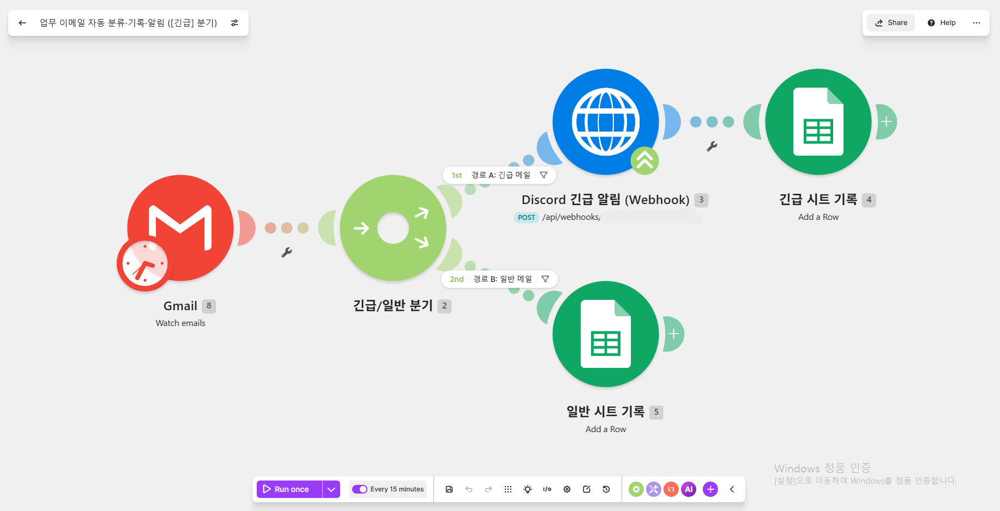
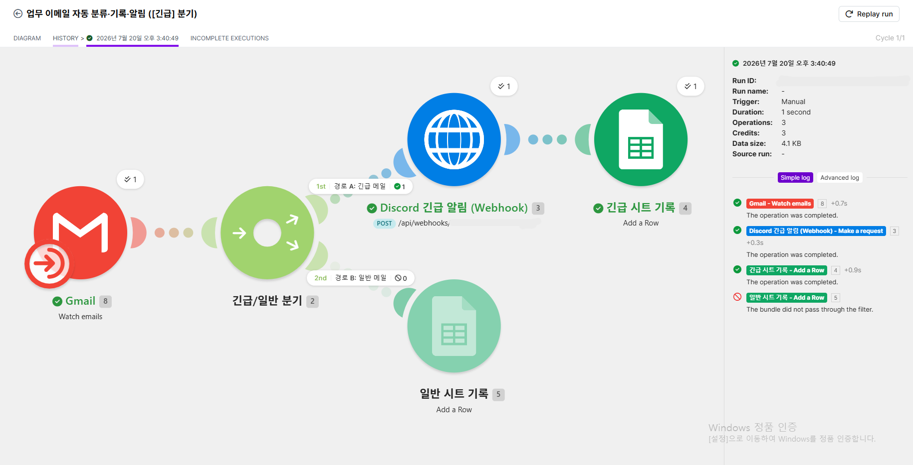
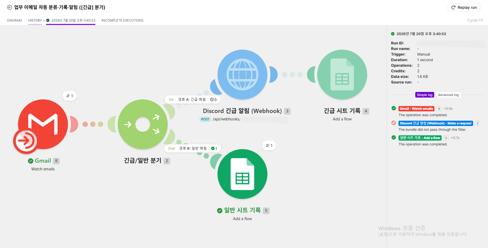
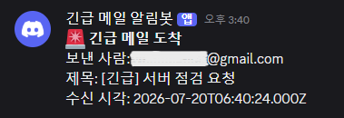
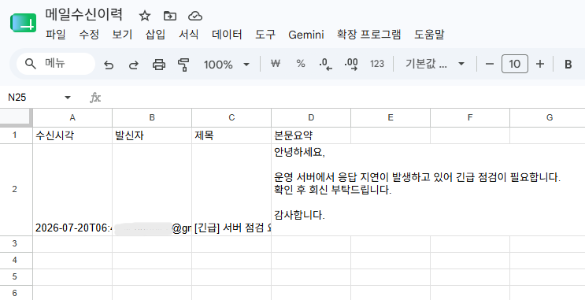
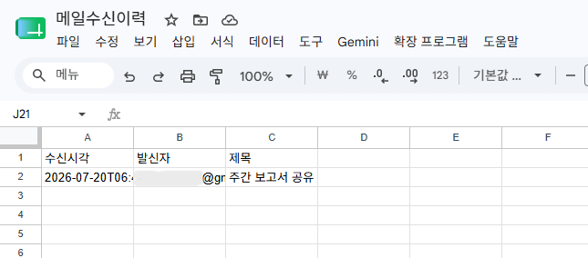

# [프로젝트 2] 자유 주제 자동화 설계 및 구현

## 1. 자동화할 반복 업무 정의

업무명: 업무 이메일 자동 분류·기록·알림

매일 Gmail로 들어오는 업무 메일을 확인하고, 중요한 메일(제목에 "[긴급]" 포함)은 즉시 팀 Discord 채널에 알리고, 모든 업무 메일은 Google Sheets에 수신 이력으로 기록하는 작업을 수작업으로 반복하고 있다.

- 발생 빈도: 하루 5~15회
- 1회당 소요 시간: 약 3분 (메일 확인 → 시트에 옮겨 적기 → 필요 시 채널 공유)
- 하루 누적: 약 15~45분
- 문제점: 반복 작업으로 인한 시간 낭비, 옮겨 적는 과정에서의 누락/오타, 긴급 메일 대응 지연

## 2. 도구 선정 및 선정 이유

선정 도구: Make

| 선정 기준 | Make가 적합한 이유 |
|---|---|
| 조건 분기 설계 | Router 모듈로 분기 경로를 시각적 노드 형태로 설계할 수 있어 "긴급/일반" 분기 구조를 직관적으로 표현 가능 |
| 무료 플랜 범위 | 월 1,000크레딧 제공 — 본 워크플로우는 실행 1회당 경로에 따라 2~3크레딧(경로 A: Gmail+HTTP+Sheets 3크레딧 / 경로 B: Gmail+Sheets 2크레딧)을 소모하므로 무료 범위 내에서 운영 가능 |
| 실행 로그 | 실행 히스토리에서 각 모듈이 주고받은 데이터를 단계별로 확인할 수 있어 디버깅과 결과 검증(스크린샷 확보)에 유리 |
| 연동 서비스 | Gmail, Google Sheets 커넥터를 공식 지원하며, Discord 역시 공식 커넥터가 있으나 봇 권한 설정 없이 즉시 사용 가능한 채널 Webhook + 범용 HTTP 모듈 방식을 선택할 수 있어 구성이 유연함 |

## 3. 워크플로우 설계

### 3-1. 전체 흐름 다이어그램

```
[Trigger] Gmail – Watch Emails (새 메일 감지, 15분 주기)
        │
        ▼
[Router] 조건 분기: 제목에 "[긴급]" 포함 여부
        │
        ├─ (경로 A: 긴급 메일)
        │      ├─ [Action 1] HTTP – Discord Webhook 호출
        │      │        → #긴급알림 채널에 발신자/제목/수신시각 알림
        │      └─ [Action 2] Google Sheets – Add a Row
        │               → "긴급" 시트에 이력 기록
        │
        └─ (경로 B: 일반 메일)
               └─ [Action 3] Google Sheets – Add a Row
                        → "일반" 시트에 이력 기록
```

### 3-2. 단계별 상세 설명

① Trigger: Gmail – Watch Emails
- 감시 대상: 받은편지함 (필요 시 특정 라벨 "업무"로 한정)
- 실행 주기: 15분마다 자동 폴링 (Scheduling 활성화 → Trigger 발생 시 자동 실행 요건 충족)
- 출력 데이터: 발신자(From), 제목(Subject), 본문(Text), 수신 시각(Date)

② Router: 조건 분기
- 경로 A 필터 조건: `Subject` **contains** `[긴급]`
- 경로 B 필터 조건: `Subject` **does not contain** `[긴급]` (fallback 경로로 설정해도 무방)

③ Action 1 (경로 A): HTTP – Discord Webhook 호출 (메시지 전송)
- 대상 채널: #긴급알림 (채널에 발급한 Incoming Webhook URL로 POST 요청)
- 방식 선택 이유: Discord 봇 연동 대비 채널 Webhook은 URL 발급만으로 즉시 사용 가능해 설정이 간단하고, Make의 HTTP 모듈로 호출하므로 추가 커넥터 권한이 불필요함
- 메시지 템플릿:
  ```
  🚨 긴급 메일 도착
  보낸 사람: {{From}}
  제목: {{Subject}}
  수신 시각: {{Date}}
  ```

④ Action 2 (경로 A): Google Sheets – Add a Row
- 대상: 스프레드시트 "메일수신이력" → 시트 "긴급"
- 기록 컬럼: 수신시각 / 발신자 / 제목 / 본문 요약(앞 100자)

⑤ Action 3 (경로 B): Google Sheets – Add a Row
- 대상: 동일 스프레드시트 → 시트 "일반"
- 기록 컬럼: 수신시각 / 발신자 / 제목

### 3-3. 요구사항 충족 확인

| 요구사항 | 충족 내용 |
|---|---|
| Trigger 1개 이상 | Gmail – Watch Emails |
| Action 2개 이상 | Discord Webhook 메시지 전송(HTTP) 1개 + Google Sheets 행 추가 2개 (총 3개) |
| 조건 분기 1개 이상 | Router (제목 "[긴급]" 포함 여부로 2개 경로 분기) |
| 자동 실행 | Scheduling 활성화로 15분 주기 자동 폴링 → 새 메일 감지 시 자동 실행 |
| 각 분기 경로 1회 이상 실행 | 테스트 메일 2통 발송 — ① 제목 "[긴급] 서버 점검 요청" → 경로 A 실행, ② 제목 "주간 보고서 공유" → 경로 B 실행 |

## 4. 테스트 시나리오 및 실행 결과

| # | 테스트 입력 | 기대 결과 | 실제 결과 |
|---|---|---|---|
| 1 | 제목 "[긴급] 서버 점검 요청" 메일 발송 | Discord #긴급알림에 메시지 도착 + "긴급" 시트에 행 추가 | 기대대로 동작 — 경로 A 실행, Discord #긴급알림에 알림 도착 확인, "긴급" 시트에 1행 추가됨 (5장 캡처 2·4·5 참고) |
| 2 | 제목 "주간 보고서 공유" 메일 발송 | Discord 알림 없음 + "일반" 시트에 행 추가 | 기대대로 동작 — 경로 B 실행, Discord 알림 없음, "일반" 시트에 1행 추가됨 (5장 캡처 3·5 참고) |

## 5. 첨부 (구현/실행 화면 캡처)

1. Make 시나리오 전체 구성 화면 (Trigger–Router–Action 노드 연결)


2. 실행 히스토리 — 경로 A(긴급) 실행 결과


3. 실행 히스토리 — 경로 B(일반) 실행 결과


4. Discord #긴급알림 채널 메시지 수신 화면


5. Google Sheets "긴급"/"일반" 시트 기록 결과



모든 캡처에서 계정 이메일 일부 및 Webhook URL/토큰은 마스킹 처리함.

## 6. 기대 효과

- 하루 약 15~45분의 반복 작업 제거
- 긴급 메일의 팀 공유 지연 해소 (수신 후 최대 15분 이내 자동 알림)
- 확인 누락 감소 및 이력 데이터 축적 (추후 통계 분석 가능)
